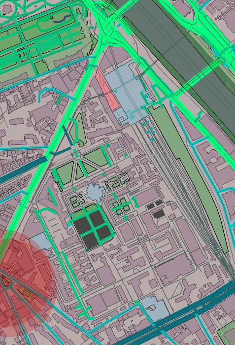
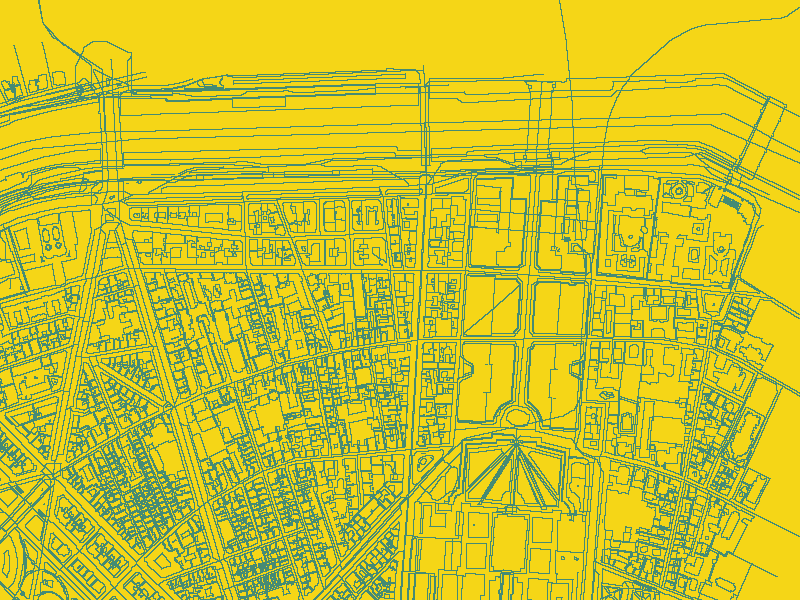
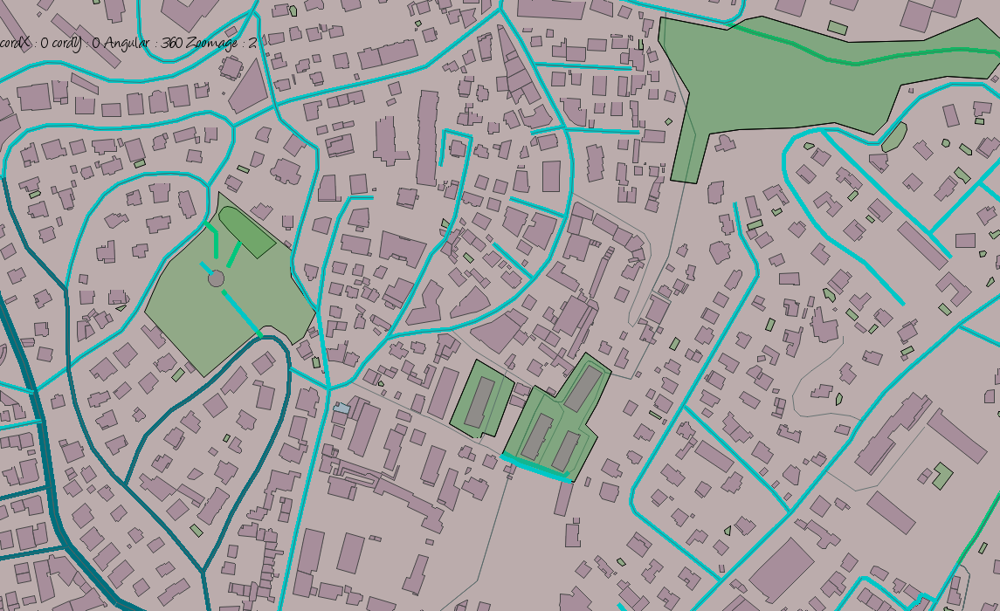
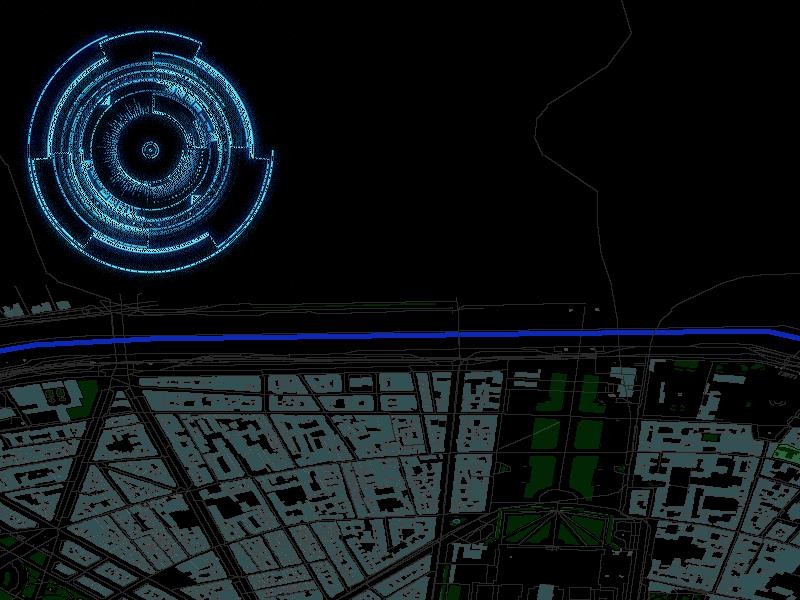

# MiniOsm
OSM project base 1

<em>projet de renderer consistant a analyser des donnees de openstreetmap pour en faire un rendu graphique en language C utilisant SDL et Libxml2</em>
Site OpenStreetMap : https://www.openstreetmap.org/

 
-MiniOSM a maintenant un site web !

-La compilation se fait avec -Wall

-Une presentation dans /source/siteWeb/index.html

-Le programme a plusieurs options mais sans argument, il lance le produit final.

-Les touches /!\ :QSDZ pour se deplacer.
 "fleche haut"= zoom avant " fleche bas"=zoom arrière "fleche droite"=inclinaison "fleche gauche"=declinaison "o"=centrage de map (si perdu dans la map)
"p"=debut d'affichage des balises names   "m"= ne plus afficher les balises names. b=inverser n=deverser

-L'option  --zoom permet de se déplacer dans la map et on peut zoomer en appuyant sur la touche a ou z pour le dezoom
Les flèches permettent de bouger dans la map (A UTILISER LORSQUE LA MAP EST TROP GRANDE (manuellement pour le moment)

-(API OVERPASS)vous pouvez placer 4 arguments (attributs de <bounds>) et cela trace la map.

-A chaque fin de programme, celui-ci génère un fichier sortie.bmp.

-style.xml est un fichier qui permet de changer les couleurs des balises grace au systeme RGBA

-l'option --svg génère un fichier dessin.svg.Faire make svg à chaque fois que vous voulez le faire /!\

-l'option --recording name  permet d'enregistrer une video des déplacements divers effectués

-l'option --play name permt de jouer ce que vous avez enregistré via la commande recording.

-l'option --search permet de localiser un lieux : ./projet ../utils/examples/12_paris_pitie_salpetriere.osm "Place Louis Armstrong" --search

 
-L'option -past trace une map façon carte au trésor , les calculs ont ete effectués de sorte à ce que la terre soit plate:

 

-L'option -present est un rendu utilisant les projections car la terre est sphérique:

) 

L'option -futur (lourd..) donne une vue en perspective de la carte:

 

-make meteo génère meteo , puis ./meteo lat lon -> affiche la météo dans le terminal
